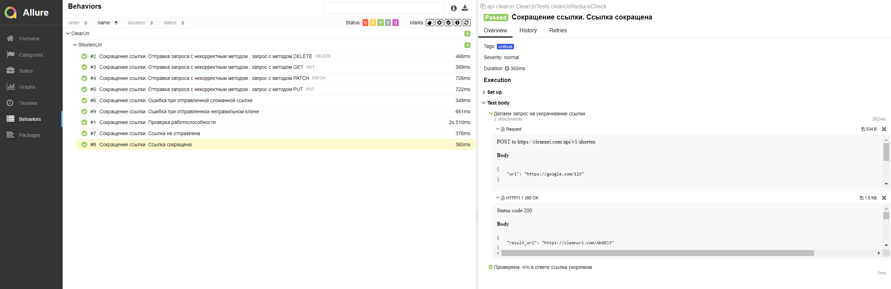

# cleanuri
**В этом репозитории находится решение тестового задания:**

1. Написать автотесты для тестирования api сервиса cleanui.com (https://cleanuri.com/docs)
2. Составить тест план (положительные + отрицательные сценарии) и покрыть его автотестами
3. Тестовые данные (строка со ссылкой на сайт, которая будет "укорачиваться" в рамках работы тестируемого сервиса) необходимо вычитывать из внешнего файла

**Тестовые сценарии:**

1. (Smoke) Получаем url и успешный статус код при отправке корректного запроса
2. (Critical) Проверяем, что полученная url имеет домен cleanuri 
2. (Negative) Получаем статус код ошибки при отправке запроса с неверным методом
3. (Negative) Получаем сообщение и статус код ошибки при отправке запроса с пустым ключом url
4. (Negative) Получаем сообщение и статус код ошибки при отправке запроса с некорректной url 
5. (Negative) Получаем сообщение и статус код ошибки при отправке запроса с некорректным ключом

Запуск тестов
```
mvn clean test
```
Сбор allure-отчета (после выполнения команды, автоматически откроется локальный отчет в браузере)
```
mvn allure:serve
```
Пример прогона тестов и собранного отчета
